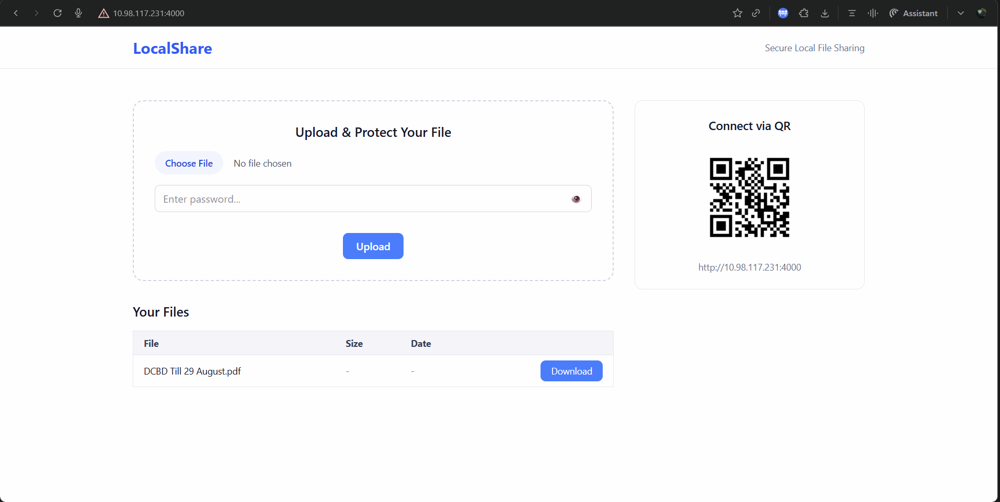

# 🗃️ LocalShare

A simple **Express + TypeScript** file-sharing web app that lets you **upload and download files securely** over your **local Wi-Fi network** — protected by per-file passwords and accessible via QR code.



## 🚀 Features

✅ **Upload files** through a browser form  
✅ **Protect each file** with a user-chosen password (hashed via bcrypt)  
✅ **Download files securely** after password verification  
✅ **View QR code** for quick mobile access  
✅ **Accessible over local network** (auto-detects your Wi-Fi IP)  
✅ **Modular & clean TypeScript architecture**

## ⚙️ Setup Instructions

### 1. Clone and Install Dependencies

```bash
git clone https://github.com/vpsop/LocalShare.git
cd LocalShare
npm install
```

### 2. Build the TypeScript Project

```bash
npm run build
```

### 3. Start the Server

```bash
npm run start
```

### 4. Example Output

```bash
Server is running!
- Local:   http://localhost:4000
- Network: http://<Network_IPv4>:4000

You can also scan this QR code with other devices on the same network:
<QR Code>
```

## 🌐 Usage

Open your browser and go to the network IPv4 address shown in the output.

Upload a file and set a password. The file is stored inside the shared/ directory.

To download a file: Enter the file name and password when prompted. If verified, the download will begin.

## 🔒 Security Model

Passwords are never stored in plaintext.

Each uploaded file’s password is bcrypt-hashed and saved in shared/localshare_metadata.json.

Downloads are only permitted after successful password verification.

Filenames are validated to prevent "directory traversal attacks".
